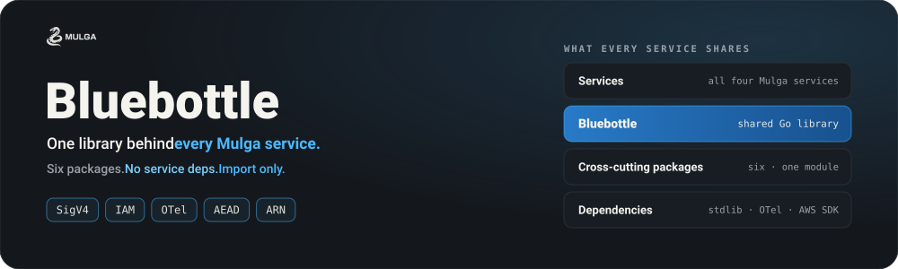

  

  
  
  

  <a href="#packages">Packages</a> ·
  <a href="#stack-integration">Stack Integration</a> ·
  <a href="https://docs.mulgadc.com">Docs</a>

---

# Bluebottle: the shared library for the Mulga stack

Bluebottle holds the cross-cutting Go packages that Spinifex, Predastore, Viperblock and Northstar all need, so that they do not depend on another service repo to get them.

## Packages

| Package | Purpose |
| --- | --- |
| [`pkg/auth`](pkg/auth) | ARN parsing and formatting |
| [`pkg/fipsboot`](pkg/fipsboot) | FIPS 140-3 startup enforcement via blank import |
| [`pkg/iampolicy`](pkg/iampolicy) | IAM policy types, matching and evaluation |
| [`pkg/masterkey`](pkg/masterkey) | Master key loading, derivation and AEAD encryption |
| [`pkg/otelsetup`](pkg/otelsetup) | OpenTelemetry tracer/meter/logger bootstrap, slog bridge, HTTP instrumentation, log sanitisation |
| [`pkg/ratelimit`](pkg/ratelimit) | Token bucket rate limiting and its configuration |
| [`pkg/safecast`](pkg/safecast) | Range-checked integer conversions |
| [`pkg/sigv4`](pkg/sigv4) | AWS SigV4 parsing, verification and URI canonicalisation |
| [`pkg/tlsconfig`](pkg/tlsconfig) | Cluster-wide TLS 1.3 curve allowlist |

## Stack Integration

Bluebottle sits below every service in the Mulga stack and depends on none of them.

| Repository | What it uses |
| --- | --- |
| **[Spinifex](https://github.com/mulgadc/spinifex)** | All nine packages: SigV4 and IAM for the AWS gateway, master keys for credential storage, telemetry, rate limiting, the TLS curve allowlist, the FIPS guard and the conversion helpers across services |
| **[Predastore](https://github.com/mulgadc/predastore)** | S3 request signing, IAM policy evaluation, encryption at rest, telemetry, rate limiting, TLS curve allowlist, FIPS guard |
| **[Viperblock](https://github.com/mulgadc/viperblock)** | Master keys for volume encryption, telemetry, FIPS guard, conversion helpers |
| **[Northstar](https://github.com/mulgadc/northstar)** | Telemetry, FIPS guard |

## Trademarks

Amazon Web Services, AWS, Amazon S3 and AWS IAM are trademarks of Amazon.com, Inc. or its affiliates. Bluebottle is not affiliated with or endorsed by Amazon Web Services.

## License

Bluebottle is licensed under the [GNU Affero General Public License v3.0 (AGPLv3)](LICENSE) license.
